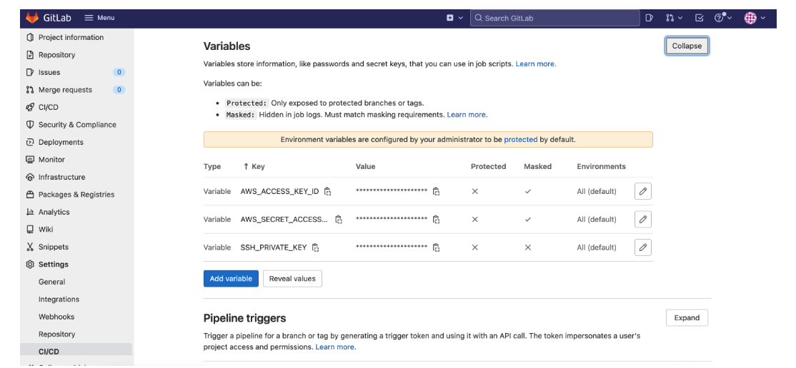
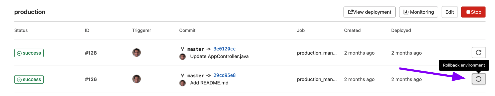

# GitLab CI/CD를 이용하여 배포 자동화

GitLab CI/CD는 연속적인 방법론을 사용하는 소프트웨어 개발 도구다. GitLab CI/CD를 통해서 애플리케이션 개발 단계를 자동화할 수 있다.

- Continuous Integration(지속적인 통합)
- Continuous Delivery(지속적인 서비스 전달)
- Continuous Deploy(지속적인 배포)

CI/CD 파이프라인을 구축하기에 앞서 해당 프로젝트의 `maintainer` 혹은 `owner` role으로 지정되어 있는지 확인

## GitLab에서 저장소 생성

GitLab에서 저장소를 생성하고 `gitlab-ci.yml` 작성

```jsx
stages: -build - deploy;

variables: AWS_ACCESS_KEY_ID: "문자열로 된 AWS ACCESS KEY ID 입력하기";
AWS_SECRET_ACCESS_KEY: "문자열로 된 AWS SECRET ACCESS KEY 입력하기";
S3_BUCKET_NAME: "yourbucket";
```

gitlab-ci.yml에 variables섹션에 참조에 필요한 변수를 추가해도 되지만, AWS 키와 같은 보안키는 위의 variables 섹션이 아닌 `Settings > CI/CD > Variables`에서 설정



만약 Variables에 변수를 설정해줬는데 배포시에 아래와 같은 에러가 발생한다면 Variables에서 Protected가 체크가 되어있는지 확인
(Varibles에 Protected 체크 박스 체크시 특정 브랜치에서만 변수 사용하겠다는 의미이기 때문에 해제)

```jsx
 fatal error: Unable to locate credentials

```

### EC2 Server에 알파서버를 배포하는 경우

SSH로 GCP EC2 Server에 접속하여 배포. 스크립트 작성에 앞서 아래와 같은 작업이 선행되어야 함

- SSH로 접근할 수 있는 서버의 존재
- 해당 프로젝트 폴더에 대한 Nginx 설정

GitLab에서 서버에 접근하여 배포가 되기 위해서는 GitLab이 해당 서버에 인증하는데 사용되는 SSH키가 필요함. GitLab에서는 SSH 비밀키(private key)를 가지고 있고 원격 서버는 SSH의 공개키(public key)를 갖고 있게 되는 GitLab에서 SSH로 접근하였을 때 해당 서버는 이 두 개의 키를 비교하여 인증을 하게 된다.

1. GitLab에서 SSH 비밀키를 갖고 있고 이를 배포시에 활용하기 위해서 **Settings > CI/CD > Variables**에 등록
2. 서버에서 SSH 공개키를 갖고 있게 하기 위해서 서버의 authorized_key 목록에 해당 키를 추가

- SSH로 접속
- 아래의 커맨드를 입력하여 authorized_keys 파일을 열어준다.

```jsx
nano ~/.ssh/authorized_keys
```

- SSH 공개 키(ssh-rsa로 시작)를 새 줄에 붙여넣기
- 파일 저장

3. 배포 스크립트 작성

```jsx
image: node:16.13.1 // Node(16.13.1버전) 도커 이미지를 시작점

stages:
  - build
	- deploy

cache:
  paths:
    - node_modules/ //빌드 속도를 향상시키기 위해 node_modules 폴더 캐싱

deploy_alpha
	stage: deploy
	before_script:
	- apt-get update -qq
	- apt-get install -qq git
	- "which ssh-agent || ( apt-get install -qq openssh-client )"
	- eval $(ssh-agent -s)
	- ssh-add <(echo "$SSH_PRIVATE_KEY" | base64 -d) // git 패키지를 설치한 다음 SSH_Private_KEY를 추가
	- mkdir -p ~/.ssh
	- '[[ -f /.dockerenv ]] && echo -e "Host *\\n\\tStrictHostKeyChecking no\\n\\n" > ~/.ssh/config'
    // SSH 접속 시 Hostkey 체크 비활성화를 위해 StrictHostKeyChecking을 no로 세팅
	script:
	- bash deploy/deploy.sh //deploy/deploy.sh 스크립트 실행
	only:
		- alpha
```

위의 `deploy.sh`스크립트 실행을 위해서 프로젝트에 deploy 폴더를 추가하고 그 아래 `deploy.sh` 파일을 추가하여 아래와 같은 내용을 추가

```jsx
#!/bin/bash

DEPLOY_SERVER=$DEPLOY_SERVER
SERVER_FOLDER="html-folder-in-server"

# Building React output
npm install
npm run build

echo "Deploying to ${DEPLOY_SERVER}"
scp -r build/ root@${DEPLOY_SERVER}:/var/www/html/${SERVER_FOLDER}/

echo "Finished copying the build files"
```

- 서버 변수와 폴더 변수를 설정
- npm install 커맨드를 통해서 의존성을 설치한 후 빌드를 시작
- 빌드가 완료되면 빌드 폴더를 서버의 /var/ww/html/html-folder-in-server/build 위치로 복사

### S3, CloudFront에 배포하는 경우

스크립트 작성에 앞서 아래와 같은 작업이 선행되어야 함

- S3 Bucket 생성
- 생성한 S3 Bucket에 익명 사용자에게 읽기전용 권한 부여
- CloudFront Distribution 생성 및 S3 Bucket과의 연결
- 액세스를 허용할 AWS 계정에 대한 액세스 권한(액세스 제어 목록 ACL) 설정 ⇒ S3는 요청자의 해당 ACL을 확인해 요청자가 필요한 액세스 권한을 보유하고 있는지 판단

S3, CloudFront배포를 스크립트에 필요한 정보

- S3버킷명
- CloudFront distributionId

AWS S3, CloudFront에 배포하기 위해서 AWS CLI에서 제공하는 명령어를 사용.
AWS Cli를 실행하기 위해서는 AWS CLI를 실행 가능한 상태로 만들어야 한다.(설치)
awscli를 설치하기 위해서는 파이썬 패키지 설치 툴인 `pip`가 필요하며Python이 미리 설치된 Docker 이미지를 지정(pip 포함)

AWS CLI 커맨드를 사용하여 S3와 CloudFront에 배포

```jsx
deploy_production:
  image: python:latest // Python이 미리 설치된 Docker 이미지
	stage: deploy
  script:
  - pip install awscli // 파이썬 패키지 툴인 pip를 이용하여 awscli 설치하기
  - aws s3 sync build s3://$S3_BUCKET_NAME --acl public-read // build폴더를 s3의 버킷과 동기화
  - aws cloudfront create-invalidation --distribution-id $DISTRIBUTION_ID --paths "/*"
  // 프로젝트에서 업데이트가 발생했을 때 cloudfront의 새로고침 작업(캐시 무효화)에 대해서 명시
```

파이프라인은 자동으로 실행시킬 수 있지만 프로덕션에 배포할 때는 수동 작업이 필요함. `when:manual` 설정을 통해 프로덕션 단계에서는 수동으로 배포. 그리고 master 브랜치에서만 실행이 될 수 있도록 아래와 같이 추가. 또한 build stage는 프로덕션 배포에만 사용되므로 master브랜치를 명시

```jsx
only: -master;
```

```jsx
image: node:16.13.1

build:
  stage: build
  script:
    - npm install
    - npm run build
	# 만료 시간 설정
	artifacts:
		expire_in: 1 hour
		# 다음 stage에서 사용할 파일 경로 지정
		paths:
      - build
	only:
		refs:
		- master

deploy_production:
  image: python:latest // Python이 미리 설치된 Docker 이미지
	stage: deploy
  script:
  - pip install awscli // 파이썬 패키지 툴인 pip를 이용하여 awscli 설치하기
  - aws s3 sync build s3://$S3_BUCKET_NAME --acl public-read
	- aws cloudfront create-invalidation --distribution-id $DISTRIBUTION_ID --paths "/*"
# 해당 stage는 master 브랜치에서만 실행
	only:
	- master
# 프로덕션 단계에서는 수동 배포
  when: manual
```

## 롤백(Roll Back) or 재시도(Retry)

배포에 문제가 있으면 다시 시도하거나 롤백할 수 있음



참조

- https://medium.com/swlh/deploying-a-react-app-on-aws-with-gitlab-ci-1a9c3222f786
- https://medium.com/@andy.ferdian.inc/gitlab-ci-cd-auto-deployment-react-app-to-aws-s3-static-website-hosting-557848b04620
- https://about.gitlab.com/blog/2021/02/05/ci-deployment-and-environments/
- https://velog.io/@hoi/GitLab-CICD%EB%A5%BC-%ED%99%9C%EC%9A%A9%ED%95%9C-AWS-S3-%EB%B0%B0%ED%8F%AC
- https://medium.com/hackernoon/configuring-gitlab-ci-yml-150a98e9765d
- https://docs.aws.amazon.com/cli/latest/index.html
- https://dev.to/atdigitals/build-and-deploy-react-using-gitlab-ci-pipeline-2bhc
