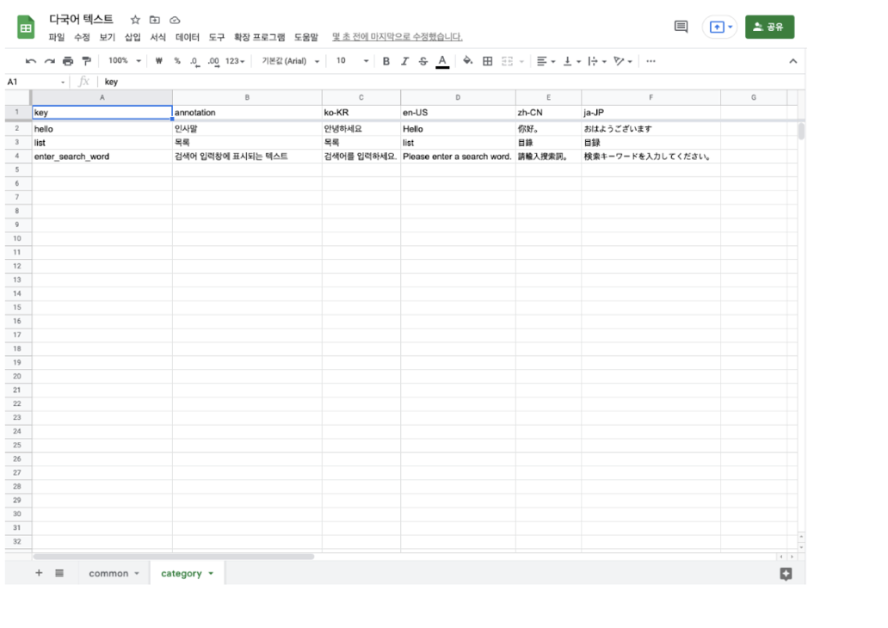
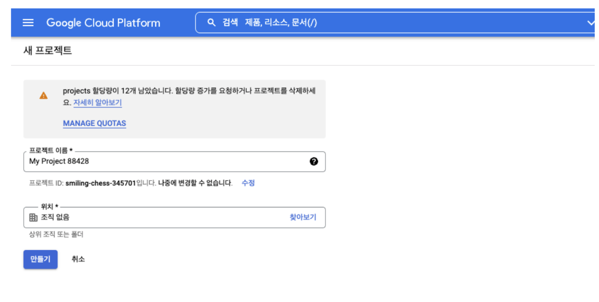
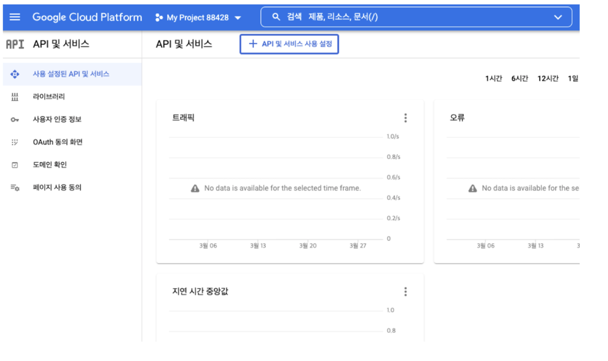
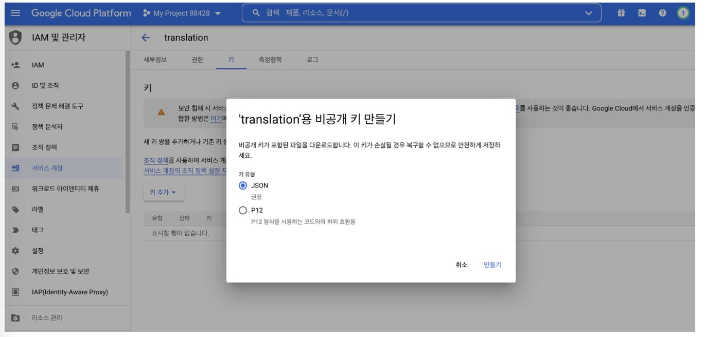

## Google Sheets API 연동을 위한 선행 작업

1. 다국어 텍스트 시트 준비한다.
   
2. Google Cloud Platform에 접속해서 새 프로젝트를 생성
   
3. API 및 서비스 -> API 및 서비스 사용 설정 -> Google Sheets를 검색 -> 해당 API를 사용으로 변경
   
4. 서비스 계정 생성
   
5. 키를 만들면 JSON키 파일을 다운로드 할 수 있음
   
6. 마지막으로 다국어 시트를 생성한 서비스 계정에 공유

## React 애플리케이션에서 다국어 시트를 JSON파일로 변환하기

React에서 프로젝트를 생성하고, Google Sheets API를 연동하기 위해 google-spreadsheet 라이브러리를 설치

### Sheet를 Json으로 변환하는 간단한 모듈 개발하기

`.env` 파일에 스크립트에서 참조하는 환경변수를 선언한다.

```jsx
// .env
DOC_ID = { DOC_ID입력 };
CLIENT_EMAIL = { CLIENT_EMAIL입력 };
PRIVATE_KEY = { PRIVATE_KEY입력 };
```

google-spreadsheet 라이브러리를 활용하여 sheet 데이터를 JSON 파일로 변환하는 로직 구현

```jsx
//sheet-to-json.js
const fs = require("fs");
const { GoogleSpreadsheet } = require("google-spreadsheet");

require("dotenv").config();

(async function () {
  // 시트 초기화 - Sheet URL에 있는 docID 입력
  const doc = new GoogleSpreadsheet(process.env.DOC_ID);

  // 인증 초기화
  await doc.useServiceAccountAuth({
    client_email: process.env.CLIENT_EMAIL,
    private_key: process.env.PRIVATE_KEY.replace(/\\\\n/gm, "\\n"),
  });

  await doc.loadInfo();

  const sheets = await Object.values(doc._rawSheets);

  // 지원하는 언어 - 한국어, 영어, 중국어, 일본어
  const supportedLang = ["ko-KR", "en-US", "zh-CN", "ja-JP"];

  for await (let sheet of sheets) {
    // 숨김 처리된 시트는 스크립트를 실행하지 않음
    if (!sheet._rawProperties.hidden) {
      const rows = await sheet.getRows();

      supportedLang.forEach((lang) => {
        const obj = rows.reduce((acc, cur) => {
          return { ...acc, ...{ [cur.key]: cur[lang] } };
        }, {});

        const data = JSON.stringify(obj);

        // json파일 저장 위치
        const dir = `public/assets/locales/${lang}`;

        if (!fs.existsSync(dir)) {
          fs.mkdirSync(dir, { recursive: true });
        }

        // 동기식으로 파일 쓰기(writeFileSync)
        try {
          fs.writeFileSync(`${dir}/${sheet.title}.json`, data);
          console.log("File written successfully");
        } catch (err) {
          console.error(err);
        }
      });
    }
  }
})();
```

### package.json 파일에 npm 스크립트 추가하기

```jsx
{
  "scripts": {
    "sheetToJson": "node sheet-to-json.js"
  }
}
```

### 실행 방법

1. package.json파일에 npm 스크립트 추가했을 경우
   `npm run sheetToJson`

2. node 사용 방법 (npm 스크립트 추가 없이 사용 가능)
   `cd script/ <- cd "폴더명"` `으로 해당 파일 위치 폴더로 이동`
   `node sheet-to-json.js <- node 파일명 실행`

참고

- https://meetup.toast.com/posts/295
- https://code-bross.tistory.com/12
- https://frhyme.github.io/googlecloudplatform/GCP000_Access_Google_sheet_by_python/
- https://www.npmjs.com/package/google-spreadsheet
- https://theoephraim.github.io/node-google-spreadsheet/#/getting-started/authentication
