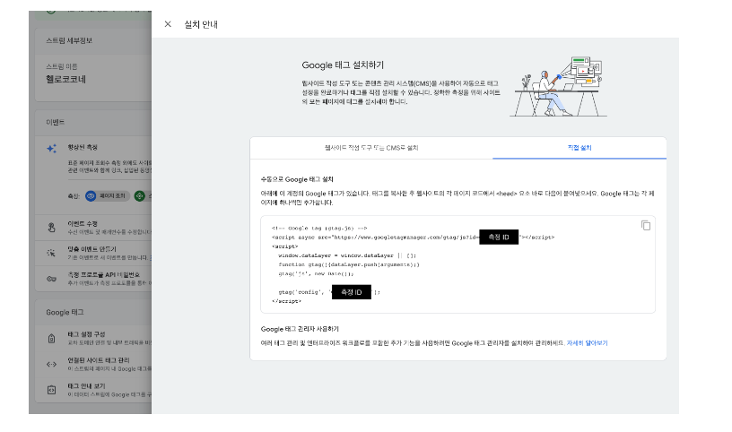

## React 프로젝트에 Google Analytics 연동하는 방법

1. index.html 파일에 수동으로 Google 태그 설치

- 관리 → 데이터스트림 메뉴에서 확인 가능
  

```jsx
<!-- Google tag (gtag.js) -->
<script async src="<https://www.googletagmanager.com/gtag/js?id=G-000000000>"></script>
<script>
      window.dataLayer = window.dataLayer || [];
      function gtag(){dataLayer.push(arguments);}
      gtag('js', new Date());

      gtag('config', 'G-000000000');
</script>
```

2. react-ga, history 설치

- [react-ga](https://www.npmjs.com/package/react-ga)
- [history](https://www.npmjs.com/package/history)

3. App.tsx에서 추적하기

- 측정 ID를 환경변수로 저장하기

```jsx
REACT_APP_GA_TRACKING_ID = G - 000000000;
```

- App.tsx파일에 코드 추가

```jsx
import { useEffect } from "react";

import { useLocation } from "react-router-dom";
import ReactGA from "react-ga4";

/**
 * uri 변경 추적 컴포넌트
 * uri가 변경될 때마다 pageview 이벤트 전송
 */

const trackingId = process.env.REACT_APP_GA_TRACKING_ID;

export default function RouteChangeTracker() {
  const location = useLocation();

  useEffect(() => {
    if (trackingId) {
      ReactGA.initialize(trackingId);
      ReactGA.set({ page: location.pathname });
      ReactGA.send("pageview");
    }
  }, [location]);

  return null;
}
```
