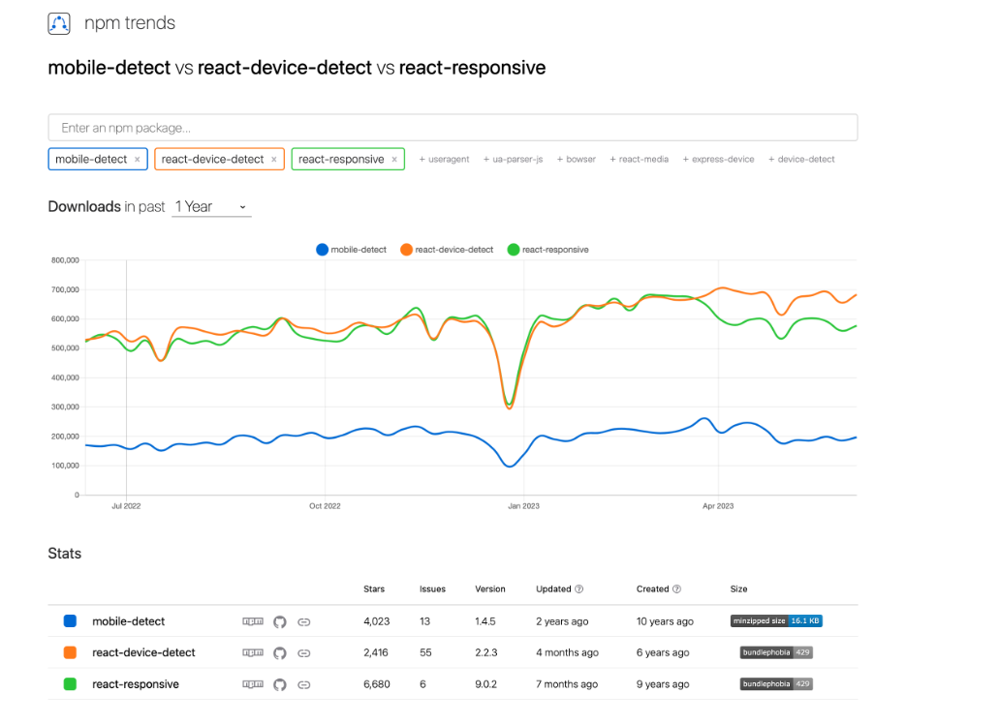

- React로 어플리케이션 구현 시, PC와 Mobile을 구분해서 반응형으로 제작할 때 npm 라이브러리를 사용할 수 있다.
- 대표적으로 **'`react-device-detect'` , '`react-responsive'`** 가 있으며, 사용률은 npm trends 기준 `react-device-detect` 가 높다.

## **react-device-detect**

- 플랫폼/디바이스를 확인해 분기 처리할 수 있으며, 특정 조건에 맞춰 Android/IOS에 따라 해당 어플리케이션으로 링크 연결도 가능하다.

### 설치

```
npm install react-device-detect --save or yarn add react-device-detect
```

### 사용

- 브라우저/모바일 뷰가 필요한 경우

```javascript
 import { BrowserView, MobileView, isBrowser, isMobile } from 'react-device-detect';

<BrowserView> <h1>This is rendered only in browser</h1> </BrowserView>
<MobileView> <h1>This is rendered only on mobile</h1> </MobileView>
```

---

- 모바일 뷰만 필요한 경우 : `isMobile` 조건 추가

```javascript
 import {isMobile} from 'react-device-detect';

function App() {
  renderContent = () => {
    if (isMobile) {
      return <div> This content is available only on mobile</div>
    }
    return <div> ...content </div>
  }

  render() {
    return this.renderContent();
  }
}
```

- 특정 브라우저/디바이스에 따른 화면 구현할 경우

```javascript
import { browserName, CustomView } from 'react-device-detect';

function App() {
  render() {
    return (
      <CustomView condition={browserName === "Chrome"}>
        <div>...content</div>
      </CustomView>
    )
  }
}
```

- 지원하지 않는 브라우저에 접속했을 경우

```javascript
import { isIE } from 'react-device-detect';

function App() {
  render() {
    if (isIE) return <div> IE is not supported. Download Chrome/Opera/Firefox </div>
    return (
      <div>...content</div>
    )
  }
}
```

## **react-responsive**

- 반응형 디자인을 위한 React의 미디어쿼리로 `useMediaQuery` Hook을 사용해 브라우저 크기(width)에 따른 화면 구현이 가능하다.
- 화면 별 특정 사이즈를 직접 지정할 수 있어 다양한 화면 크기를 안정적으로 반응형으로 바꿔줄 수 있고, 자동 인식이 어려운 브라우저를 섬세하게 컨트롤 할 수 있다는 장점이 있다.

### 설치

```
 $ npm install react-responsive --save
```

### 사용

- Hooks 만들기

```javascript
import React from "react";
import { useMediaQuery } from "react-responsive";

const Example = () => {
  const isDesktopOrLaptop = useMediaQuery({
    query: "(min-width: 1224px)",
  });
  const isBigScreen = useMediaQuery({ query: "(min-width: 1824px)" });
  const isTabletOrMobile = useMediaQuery({ query: "(max-width: 1224px)" });
  const isPortrait = useMediaQuery({ query: "(orientation: portrait)" });
  const isRetina = useMediaQuery({ query: "(min-resolution: 2dppx)" });

  return (
    <div>
      <h1>Device Test!</h1>
      {isDesktopOrLaptop && <p>You are a desktop or laptop</p>}
      {isBigScreen && <p>You have a huge screen</p>}
      {isTabletOrMobile && <p>You are a tablet or mobile phone</p>}
      <p>Your are in {isPortrait ? "portrait" : "landscape"} orientation</p>
      {isRetina && <p>You are retina</p>}
    </div>
  );
};
```

- 컴포넌트에서 쓰기

```javascript
import MediaQuery from "react-responsive";

const Example = () => (
  <div>
    <h1>Device Test!</h1>
    <MediaQuery minWidth={1224}>
      <p>You are a desktop or laptop</p>
      <MediaQuery minWidth={1824}>
        <p>You also have a huge screen</p>
      </MediaQuery>
    </MediaQuery>
    <MediaQuery minResolution="2dppx">
      {/* You can also use a function (render prop) as a child */}
      {(matches) =>
        matches ? <p>You are retina</p> : <p>You are not retina</p>
      }
    </MediaQuery>
  </div>
);
```

- device props로 쓰기

```javascript
import { useMediaQuery } from "react-responsive";

const Example = () => {
  const isDesktopOrLaptop = useMediaQuery(
    { minDeviceWidth: 1224 },
    { deviceWidth: 1600 }, // `device` prop
  );

  return (
    <div>
      {isDesktopOrLaptop && (
        <p>
          this will always get rendered even if device is shorter than 1224px,
          that's because we overrode device settings with 'deviceWidth: 1600'.
        </p>
      )}
    </div>
  );
};
```

- breakpoints 설정해서 간단하게 쓰기

```javascript
import { useMediaQuery } from "react-responsive";

const Desktop = ({ children }) => {
  const isDesktop = useMediaQuery({ minWidth: 992 });
  return isDesktop ? children : null;
};
const Tablet = ({ children }) => {
  const isTablet = useMediaQuery({ minWidth: 768, maxWidth: 991 });
  return isTablet ? children : null;
};
const Mobile = ({ children }) => {
  const isMobile = useMediaQuery({ maxWidth: 767 });
  return isMobile ? children : null;
};
const Default = ({ children }) => {
  const isNotMobile = useMediaQuery({ minWidth: 768 });
  return isNotMobile ? children : null;
};

const Example = () => (
  <div>
    <Desktop>Desktop or laptop</Desktop>
    <Tablet>Tablet</Tablet>
    <Mobile>Mobile</Mobile>
    <Default>Not mobile (desktop or laptop or tablet)</Default>
  </div>
);

export default Example;
```

## 정리

- 특정 브라우저 타입(Chrome, Safari, IE) 혹은 특정 카테고리 디바이스(all iPods..) 인식이 필요한 경우 `react-device-detect` 를,
- 전반적인 모바일 환경 대응이 필요한 경우에는 CSS ‘@media queries(`react-responsive`)’나 ‘matchMedia’ 를 쓸 수 있다.
