## 1. 아이템 생성

`Dashboard → 새로운 Item`
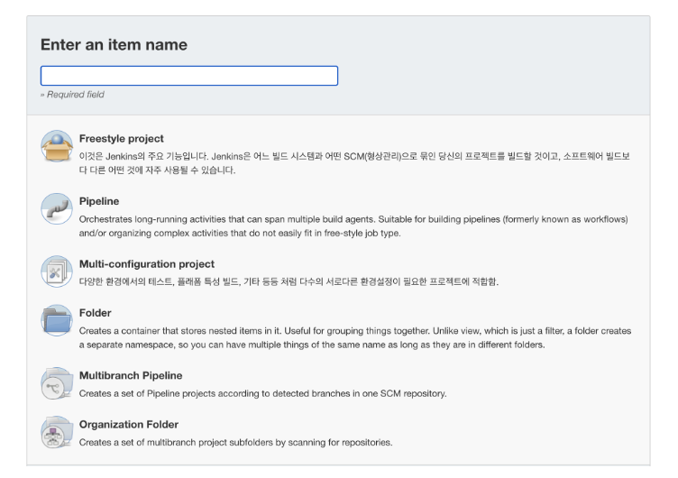

1. **Enter an item name**
   - 프로젝트 명 입력
2. **Freestyle project 선택**

## 2. 테스트 구성 세팅

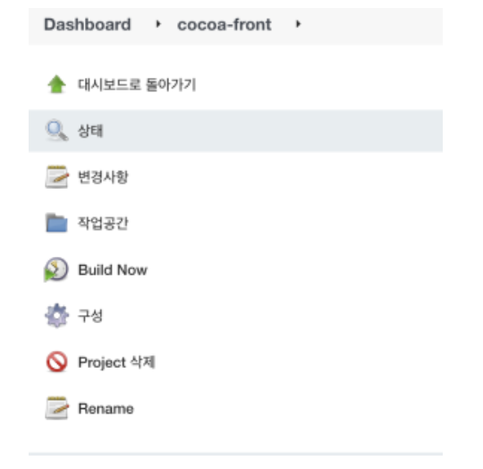
`메뉴 → 구성`

### 2-1. 소스코드 관리

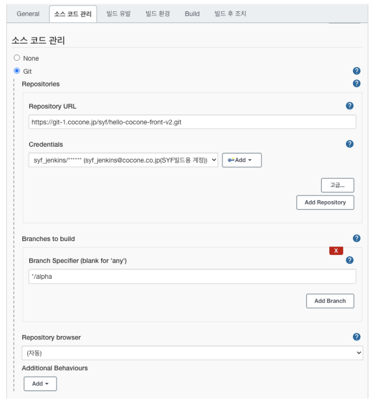

1. **Repository URL**
   - 해당 Repository URL 입력(https://git-1.cocone.jp/syf/hello-cocone-front-v2.git → GitLab > Clone > HTTPS clone 복사)
2. **Credentials**
   - 추가되어있는 자격증명 키 입력
     - 키가 없을 경우 gitlab 레포의 Project information - Members - 'syf_jenkins' (Developer 권한) 추가
3. **Branch Specifier (blank for 'any')**
   - 이벤트가 일어날 git branch 입력 (ex. /develop)

### 2-2. 빌드 유발

- 빌드가 일어날 상태를 정의
- 필요에 따라 항목을 선택
  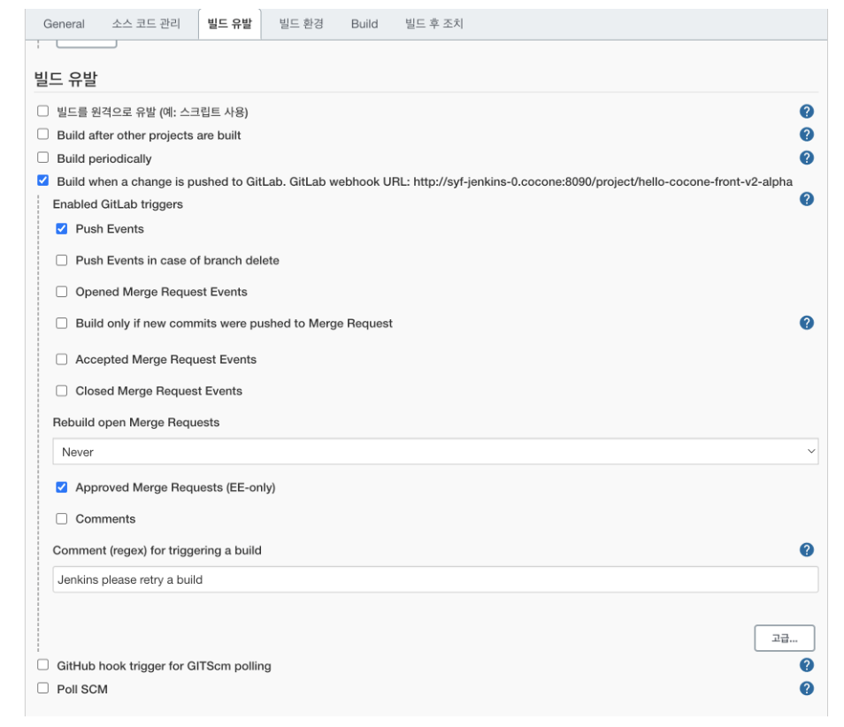

1. **빌드를 원격으로 유발**

- 외부에서 URL을 통해 빌드를 진행할 수 있도록 설정
- 인증 토큰값 설정 - 외부 파라미터로 토큰 전달받아 일치시 빌드 진행

2. **Build after other projects are built**

- 다른 프로젝트를 빌드한 후 이어서 현재 프로젝트 빌드
- 빌드 결과 stable/unstable/fails에 따른 빌드 진행 설정

3. **Build periodically**

- 설정해 놓은 시간에 자동으로 빌드 진행

4. **Build when a change is pushed to GitLab...**

- **push event** git Repository 에 push 이벤트가 일어났을 경우 실행
- **Opened Merge Request Events** pull request 가 생성되었을경우 시행
- **Approved Merge Requests (EE-only)**pull request가 병합 되었을경우 실행

5. **Github hook trigger for GITSom polling**

- Github 저장소와 젠킨스 프로젝트를 연동을 통해 빌드 환경을 구성 한 후,
- Github Webhook을 이용하여 Github 저장소에 push된 것이 있다면 그 때 젠킨스가 polling하여 빌드 실행

6. **Poll SCM**

- 형상관리 서버를 주기적으로 감시하여 변경된 사항이 존재할때 빌드 수행
- 시간값을 등록, 해당 시간에 형상관리 서버를 확인하여 변경된 사항이 있다면 빌드 수행

### 2-2-GitLab. 빌드 유발 관련 GitLab 설정

빌드 유발 세팅 후 GitLab에 추가 설정 필요
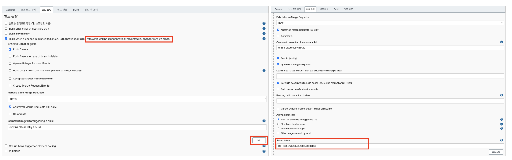

1. Build when a change is pushed to GitLab. GitLab webhook URL 복사해두기
2. 빌드 유발 하단 > 고급... > Secret token 복사해두기

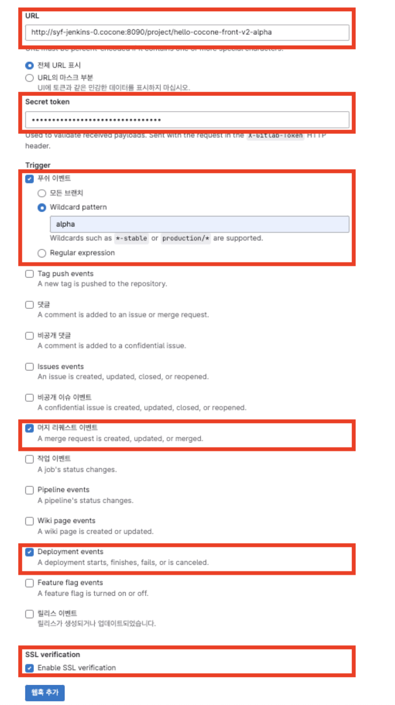

3. URL: Jenkis 에서 복사한 (Build when a change is pushed to GitLab. GitLab webhook URL) 입력

4. Secret token: Jenkins 에서 복사한 (Secret token) 입력

5. Trigger > 푸시 이벤트 체크 후 > Wildcard pattern 에 원하는 브랜치 입력

6. Trigger > 머지 리퀘스트 이벤트 체크

7. Trigger > Deployment events 체크

8. SSL verification > Enable SSL verification 체크

9. 웹훅 추가 버튼 클릭

### 2-3. Build

Build 시 실행되어야 할 스크립트 정의
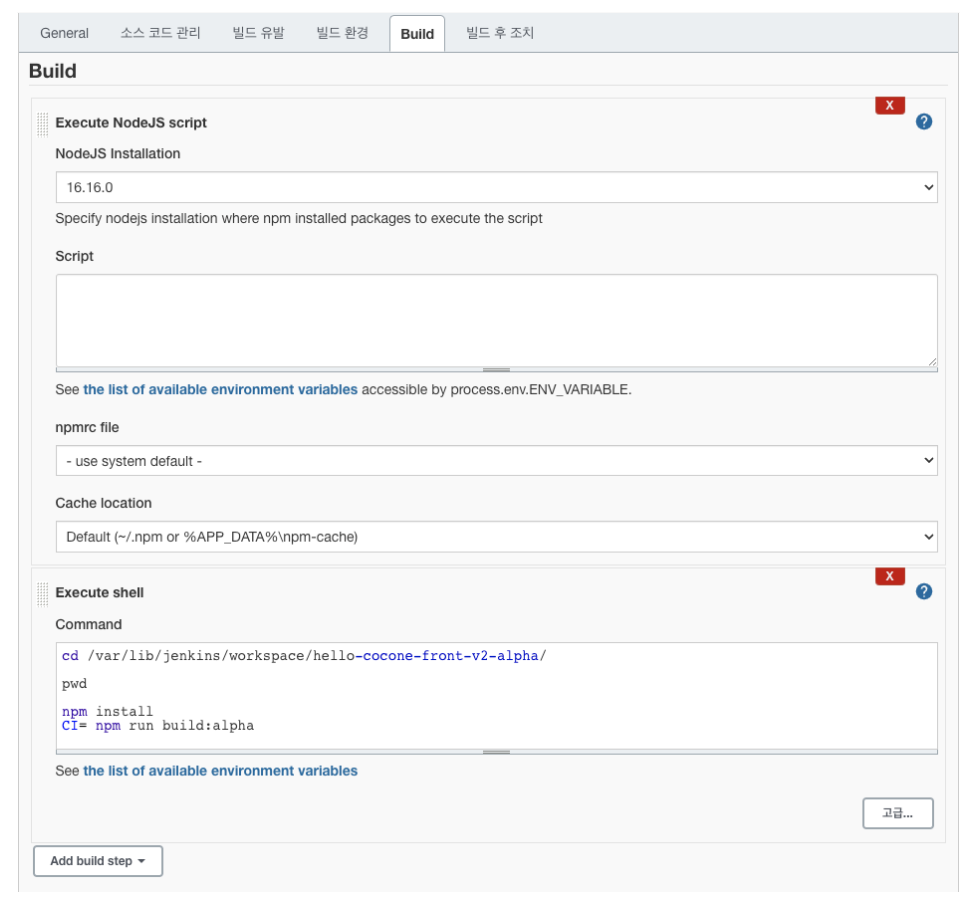

1. nodeJs 설치
   - 하단 참조
2. Execute shell
   - 빌드시 실행 시킬 명령어
   1. `cd /var/lib/jenkins/workspace/(프로젝트명)` - jenkins의 workspace(Dashboard)의 해당 프로젝트 위치
   2. `npm install` - node package 설치
   3. `CI=npm run build:dev`
      - build script 실행
      - build script 앞에 `CI=` 를 붙일 시 eslint 에러를 무시한다.
      - eslint에러가 있을시 빌드 실패

### 2-4. Build 후 조치

빌드 후 일어날 작업
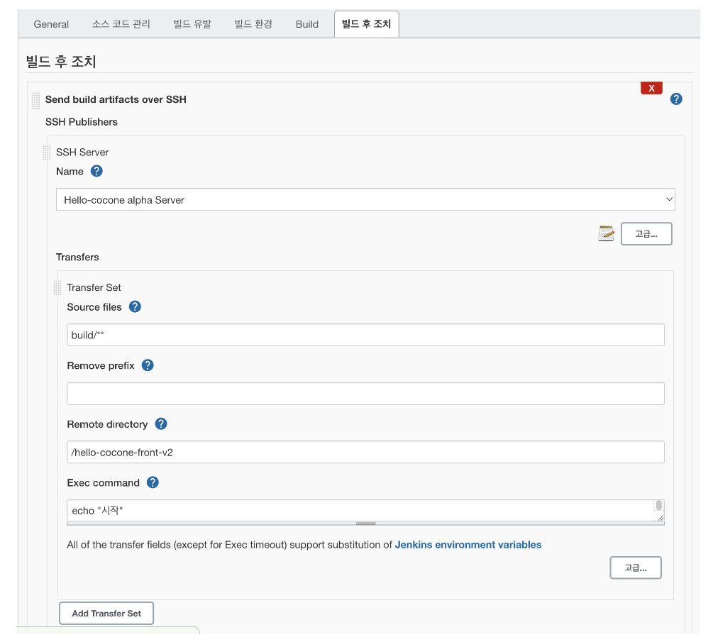

1.  **Name**
    publish over SSH 로 설정한 원격 서버

2.  **Transfers**
    1.  **Source files**
        - 해당 Item 으로 부터 원격 서버로 보낼 파일 or 폴더의 경로
          - `build/**` → `/var/lib/jenkins/workspace/test/build/**`
    2.  **Remove prefix**
        - 원격서버로 접속/파일 전송 시 source files 에서 제거할 폴더(경로) 명
          - `build/index.html` → `index.html`
    3.  **Remote directory**
        - 전송시킨 폴더(파일) 이 저장될 원격 서버 폴더 경로
    4.  **Exec command**
        - 파일 전송이 완료된 이후에 원격 서버에서 실행될 스크립트
3.  **Slack Notification**
    빌드 경과 슬랙으로 전송 '고급' - Include Custom Message에서 과정 별 메시지 설정 '빌드 후 조치 추가' 메뉴에서 다른 알림 설정 가능
    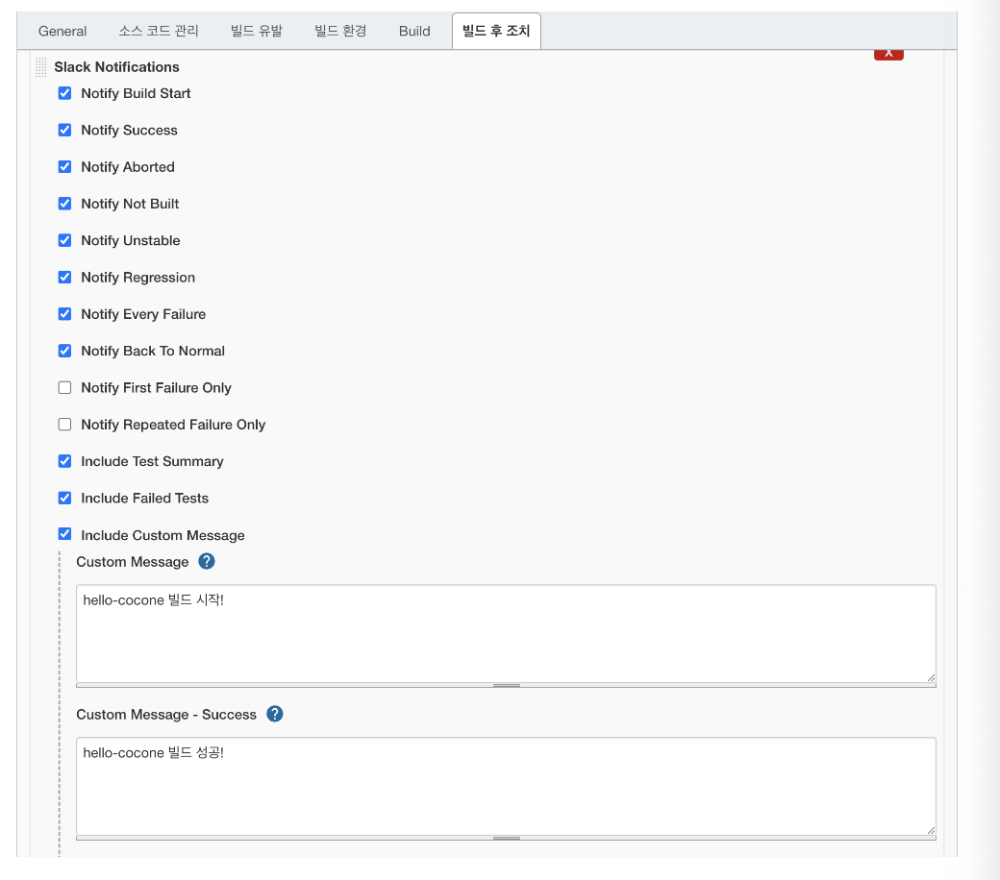

## Node 설치

### 1. Nodejs 플러그인 설치

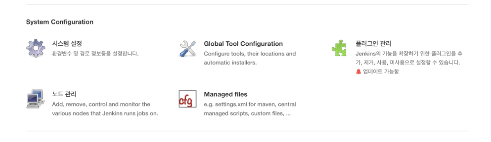
`Dashboard → jenkins관리 → 플러그인 관리`

- 설치 가능 탭 확인
  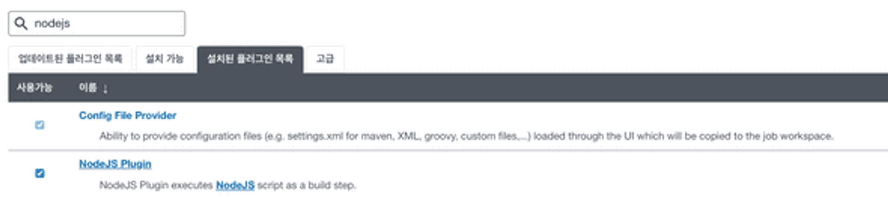

### 2. Nodejs 빌드 설정

`Dashboard → jenkins관리 → Global Tool Configuration`

- NodeJs 항목
  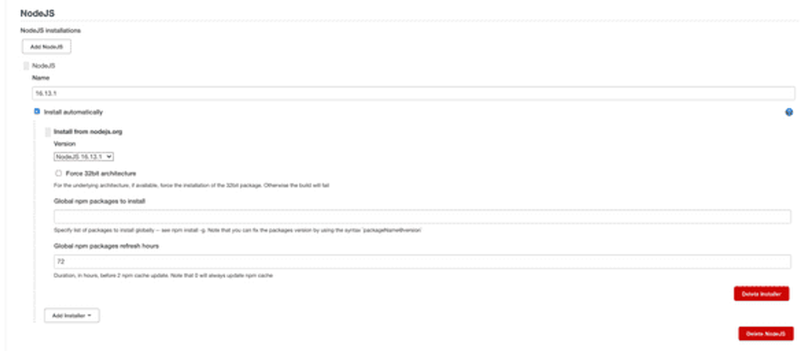
  1. **Name** 표기할 nodeJs 이름 작성
  2. **Install from [nodejs.org](http://nodejs.org/)**
  - Version - 사용할 nodejs 버전 선택

### 3. 프로젝트 설정

**`Dashboad → 작업 프로젝트 → 구성`**

- 구성 페이지에서 아래로 스크롤시 **Build** 항목
- 3-1. Add build step
  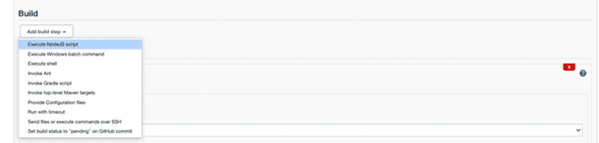
  Add build step 버튼 클릭 후 execute NodeJs script 선택
- 3-2. Execute NodeJs script
  NodeJS Script 는 3 항목(Execute Shell) 에서 입력
  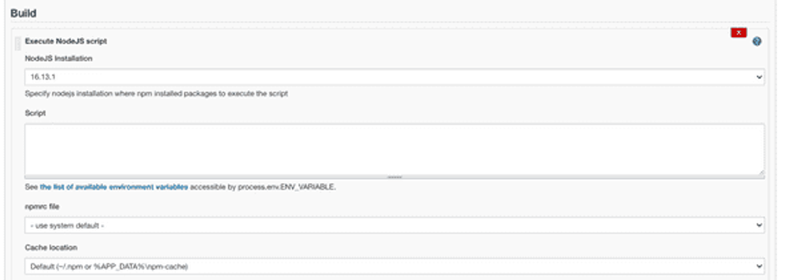
  1. NodeJs Installation
  2. NodeJs 빌드 설정 에서 생성한 nodeJs 선택
- 3-3. Execute Shell
  **Command**실행할 빌드 스크립트 입력`ex) npm i / npm run build`
  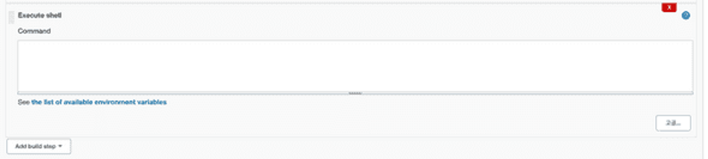
