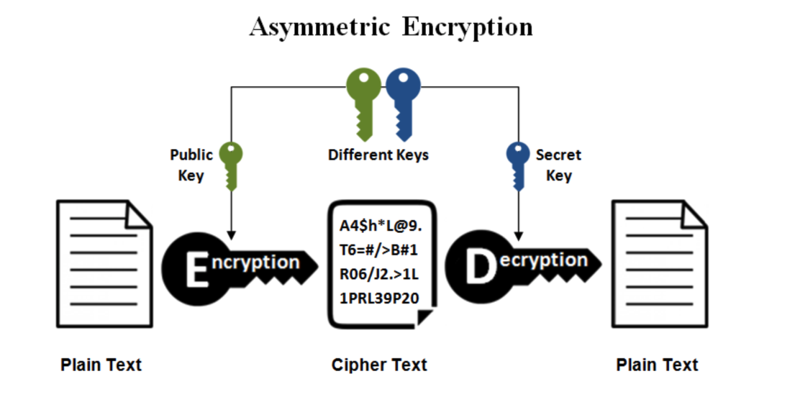
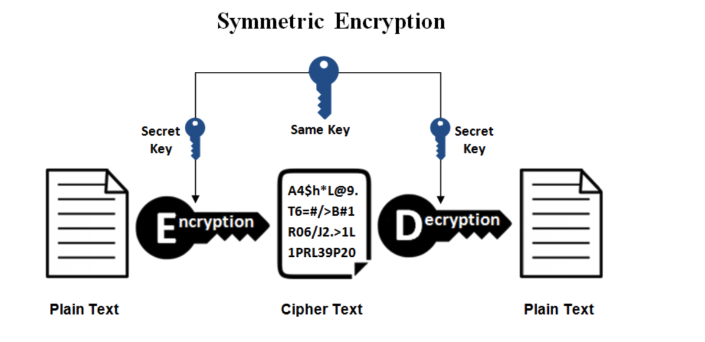
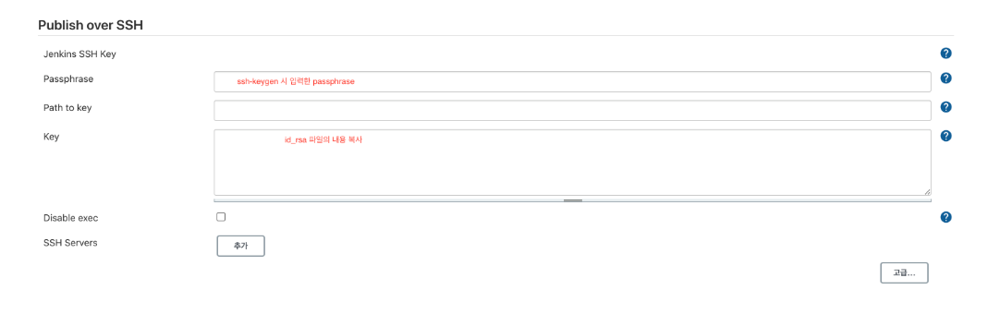
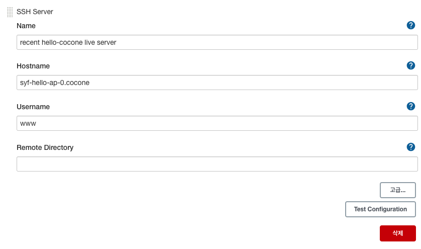

## SSH(Secured SHell)

SSH는 보안되지 않은 네트워크에서 시스템 관리 및 파일 전송을 안전하게 만들어주는 소프트웨어 패키지로 SSH protocol을 통해 클라이언트와 서버간의 안전한 연결을 위한 암호화 쌍을 만들어 낸다.

- Shell(쉘): 명령어와 프로그램을 사용할 때 쓰는 인터페이스. 커널과 사용자 간의 다리 역할을 하는 것으로, 사용자로부터 명령을 받아 그것을 해석하고 실행함. 흔히 검은 바탕에 흰 글자가 나오는 명령어 입력 환경
- 기존 원격 접속은 ‘텔넷(Telnet)’이라는 방식을 사용했는데, 암호화를 제공하지 않기 때문에 보안상 취약하다는 단점이 있었음. 때문에 이를 암호화하는 SSH 기술이 등장했고, 현재 원격 접속 보안을 위한 필수적인 요소로 자리잡았음. 클라우드 서비스에서 제공하는 서버는 서버 생성시 필수적으로 SSH 보안 과정을 거치게 되어 있음

## 작동원리

SSH를 구성하는 핵심은 ‘KEY(키)’. 사용자(클라이언트)와 서버(호스트)는 각각의 키를 보유하고 있으며, 이 키를 이용해 연결 상대를 인증하고 안전하게 데이터를 주고 받게 된다.

### 키 생성 방식

**1) 비대칭키 방식 (공개키 암호화 방식) (Asymmetric Encryption)**

암복호화에 사용하는 키가 서로 다른 암호화 방식. 공개 키와 개인 키를 암호화, 복호화에 적용하여 암복호화 하는 것을 의미

비대칭키 방식에서는 서버 또는 사용자가 공개 키(.pub)와 개인 키(.pem)의 두 가지로 이루어진 Key Pair(키 페어, 키 쌍)를 생성함.



- 사용자의 공개 키를 암호화해 서버에 전송 (\*공개 키는 전송과정에서 유출되어도 크게 문제가 되지 않음. )
- 서버는 공개 키를 받아서, 이 공개 키로 만들어진 랜덤한 값을 생성하고 사용자에게 전송. (사용자가 올바른 키 페어를 가지고 있는지 확인하는 과정)
- 사용자는 개인 키를 이용해 서버로부터 전달받은 값을 풀어내 다시 서버에 전송
- 서버는 사용자로부터 전송받은 값을 자신이 처음에 낸 값과 비교. 두 값이 같게 되면 서버는 “이 사용자는 내 공개 키에 대응하는 올바른 개인 키를 보유하고 있으니, 내가 아는 사용자가 맞다!” 라고 판단하고 접속을 허용해줌
  - 오직 키 페어 생성 시 함께 생성된 개인 키와 공개 키만 서로 해석이 가능하고, 다른 공개 키나 개인 키를 이용해서 풀어낼 수 없음
  - 공개키는 누구나 알 수 있지만, 그에 대응하는 비밀키는 키의 소유자만이 알 수 있어서 특정한 비밀키를 가지는 사용자만이 내용을 열어볼 수 있도록 하는 방식.
- 암호화할 때의 키는 공개키(public key), 복호화할 때의 키는 개인키(private key) 사용
  1. **개인 키(Private Key)** : 클라이언트 측에 저장되는 비밀 키. 개인 키는 비밀로 유지되어야 하며, 키의 소유자만 액세스할 수 있어야 한다.
  2. **공개 키(Public Key)** : 서버 측에 저장되는 공개적으로 공유되는 키. 공개 키는 개인 키에 대한 매치되는 키이며, 암호화된 데이터를 복호화하는 데 사용된다. 공개 키는 클라이언트에서 서버로 전송되어 서버에서 인증에 사용된다.
- 공개키로 암호화한 메세지는 수신자의 개인키로만 해독할 수 있으므로 안전성이 높지만, 대칭키 알고리즘에 비해 속도가 느림

**2) 대칭키 방식 (Symmetric Encryption)**
암복호화에 사용하는 키가 동일한 암호화 방식



- 대칭키 방식에서는 비대칭키 방식과 달리 한 개의 키만을 사용함.
- 사용자 또는 서버는 하나의 대칭 키를 만들어 서로 공유. 공유된 대칭 키를 이용해 정보를 암호화하면, 받은 쪽에서 동일한 대칭 키로 암호를 풀어 정보를 습득하게 됨.
- 정보 교환이 완료되면 교환 당시 썼던 대칭 키는 폐기되고, 나중에 다시 접속할 때마다 새로운 대칭 키를 생성하여 사용하게 됨
- 비대칭키 방식에 비해 속도가 빠르지만, 대칭키 전달 과정에서 해킹 위험에 노출될 수 있음

⇒ 대칭 키와 비대칭 키 방식을 혼합하여 사용하는 경우가 많음

ex) 대칭 키를 주고받을 때만 공개키 암호화 방식(비대칭)을 사용하고 이후에는 계속 대칭키 암호화 방식으로 통신한다.

## SSH key 생성

#### SSH key 확인

```c
cat ~/.ssh/id_rsa.pub
or
ls -al ~/.ssh
```

#### SSH key 생성

```c
ssh-keygen
```

- id_rsa - 비공개키(Private Key), id_rsa.pub - 공개키(Public Key) 페어 생성

## public key 설정

- 키 내용 복사

```c
cat ~/.ssh/my_ssh_key.pub
```

- 서버 접속, `~/.ssh/authorized_keys`에 복사한 키값을 추가

```c
cat >> ~/.ssh/authorized_keys
-> 공개키 붙여 넣고, 줄바꿈 -> Ctrl + D (저장)
```

- 로컬에서 ssh 접속

```c
~/.ssh  ssh -i [private key name] [Username]@[Server IP address] -p [port number]
Enter passphrase for key '/Users/ssun/.ssh/my_ssh_key': #ssh key 비밀번호 입력
Welcome to Ubuntu 18.04.4 LTS (GNU/Linux 4.15.0-1065-aws x86_64)
```

## SSH Config 설정

- SSH 접속 정보를 Config로 등록해두면 Host name으로 간편하게 SSH 접속을 할 수 있음

1. config 파일 접근

```c
vi ~/.ssh/config
```

2. 설정

- 일반 서버 접속 설정 (SSH Public Key 사용하는 경우)

```c
Host syfWebFrontTest
    HostName 10.71.100.80 or syf-web-front-0
    User www
    IdentityFile ~/.ssh/id_rsa
    PubkeyAcceptedKeyTypes +ssh-rsa
```

- 설정 옵션
  - Host : SSH 명령에 사용할 이름
  - Hostname : Host에 지정된 이름이 매핑되는 실제 호스트명
  - User : 네트워크 커넥션에 사용되는 계정명
  - Port : 연결할 서버의 포트번호 (기본값: 22)
  - IdentitiFile : 연결 시 사용할 키의 위치 (기본 값은 프로토콜에 따라 결정)

3. 권한 설정 (필요시)

- 파일 소유권자만이 설정 파일을 읽을 수 있도록 제한

```c
chmod 440 ~/.ssh/config
```

4. 서버 접속

```c
ssh syfWebFrontTest
```

## 서버 접속

- config 설정 hostname 혹은 서버 주소로 접속

```c
$ ssh [USER]@[HOSTNAME] -p [PORT]
```

- USER : 계정
- HOSTNAME : IP 또는 호스트네임
- PORT : SSH 포트 (기본값 22일 경우 생략 가능)

### /cf/ 젠킨스 서버에 SSH 키 등록하기

Dashboard → 환경설정 → Publish over SSH

- Jenkins SSH Key 등록
  
- SSH Server 생성 후 Test Configuration, Success 뜨면 성공
  
  ⇒ 젠킨스 프로젝트 설정시 등록한 서버로 요청

### /cf/ SSH 키 삭제

```c
[www@syf-web-front-0 ~]$ cd .ssh
[www@syf-web-front-0 .ssh]$ ll
합계 12
-rw------- 1 www www 6317  8월  3 17:32 authorized_keys
-rw------- 1 www www 1675  7월 21 15:03 www-nopass
[www@syf-web-front-0 .ssh]$ vi authorized_keys
```

- 삭제 원하는 줄 dd + 저장(ctrl D) + wq!
