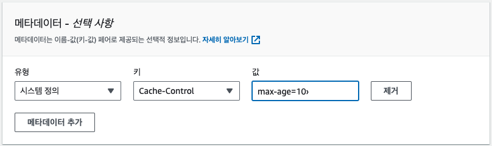

## S3 & CloudFront란?

AWS의 S3(Simple Storage Service)와 CloudFront는 둘 다 Amazon Web Services의 서비스 중에서 웹 애플리케이션과 데이터를 관리하고 배포하는데 사용되는 서비스다.

1. Amazon S3 (Simple Storage Service):
   - Amazon S3는 클라우드 기반의 객체 스토리지 서비스로, 데이터를 안전하고 확장 가능한 방식으로 저장하는 데 사용된다.
   - S3는 파일, 이미지, 동영상 등의 다양한 형식의 데이터를 저장하고 관리할 수 있다.
   - 데이터를 버킷(Bucket)이라는 단위로 저장하며, 각 버킷은 전 세계적으로 고유한 이름을 가진다.
   - 버킷 내부에는 객체(Object)라고 불리는 데이터 파일들이 저장된다.
   - S3는 데이터의 내구성과 가용성을 보장하며, 보안과 액세스 제어 기능을 제공하여 데이터를 안전하게 저장할 수 있다.
   - 웹 서비스의 정적 리소스를 저장하고 제공하거나, 데이터 백업과 복원, 로그 파일 저장 등에 주로 사용된다.
2. Amazon CloudFront:
   - 전 세계적으로 빠르고 안정적인 콘텐츠 전송 네트워크(CDN) 서비스
     - CDN은 정적 및 동적 콘텐츠를 최적의 물리적 거리에 위치한 엣지 서버를 통해 전송하여 콘텐츠의 로딩 속도를 높이고, 웹 사이트의 성능을 개선하는데 사용된다.
   - 사용자가 가까운 엣지 서버를 통해 콘텐츠를 요청하면, 해당 서버에서 캐시된 콘텐츠를 전송하여 빠른 응답을 제공한다.
   - S3와 같이 사용하면 정적 리소스를 S3에 저장하고, CloudFront를 통해 이 리소스를 더 빠르게 제공할 수 있다.
   - 웹과 애플리케이션의 전 세계적인 사용자들에게 콘텐츠를 더 가까운 위치에서 제공함으로써 성능을 향상시키고, 웹 사이트의 안정성을 높여준다.

## 배포 방법

### AWS 콘솔을 통한 S3에 파일 업로드

1. S3 버킷을 생성한다.
2. 버킷에 파일을 업로드 한다. (build 폴더 안의 파일을 이동)
3. 헤더 추가를 위한 메타데이터 설정

- 헤더를 추가할 파일(index.html) 클릭 → 메타데이터 편집 → 메타데이터 추가 → Cache-Control, Content-Type 등 설정 → 저장
- Cache-Control 은 반드시 설정할 것
- 캐싱은 사이트 업데이트될 경우를 대비해 짧게 설정한다. (기본값: 캐싱 O, 리밋 X)
  

4. ClouldFront 무효화 설정 (캐시 초기화)

- 자체 캐싱을 하기 때문에 헤더에서 캐시를 설정했다고 하더라도 자체 캐싱에서 지연될 수 있기 때문에 무효화한다.
- 원본 내용 보고 해당 ID 접속 → ‘무효화’ → 무효화 생성 버튼 클릭 → 객체 경로 추가 → 무효화 생성
- 경로 설정시 ‘/’ 전체 경로, ‘/index.html’과 같이 특정 경로 선택할 수 있음
- 전체 경로 설정시 속도가 느릴 수 있지만 특정하면 추후 변경, 추가해야하는 번거로움이 있음

배포 오류시 S3 정적 웹 사이트 호스팅 설정, CloudFront 설정에서 기본 루트 객체 index.html로 설정, 오류 페이지 경로 설정 등의 방법이 있다.
