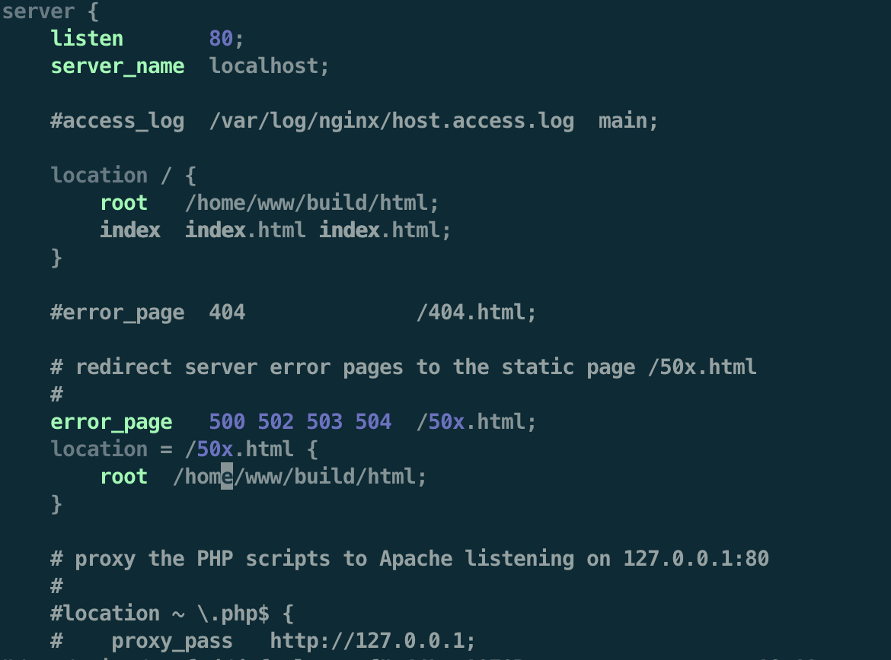

## EC2 (컴퓨팅)

- Elastic Compute Cloud(EC2)로 클라우드 컴퓨팅 서비스
- 클라우드를 통해 서버, 스토리지, 데이터베이스 등의 컴퓨팅 서비스를 제공하는 것으로 AWS에서 원격으로 제어할 수 있는 가상의 컴퓨터 한 대를 임대하는 것과 같다.
- 제공되는 가상 이미지를 ‘인스턴스(Instance)’라고 하며, 필요에 따라 사양(CPU 코어 수, 메모리 용량, 스토리지)을 변경할 수 있다.

### 서버에 Build 가져오기

#### 1. 로컬에 있는 빌드 파일을 서버에 직접 복사하기

명령어만 입력하면 되므로 빠르지만, 유지보수에 적합하지 않을 수 있음

##### 1) scp 명령어 사용

1. (ngnix 권한(root)이 없을 경우) 프로젝트에서 `npm run build`로 build 파일 생성

- index.html 파일 생성

2. 터미널(로컬)에서 프로젝트 경로로 이동 or 프로젝트 경로 build 폴더 복사(scp)

- Local (로컬) → Remote (원격지) \* 모든 명령어는 로컬 서버에서 입력한다.
- scp(secure copy protocol) 명령어
  secure copy의 줄임말로 ssh를 이용하여 네트워크로 연결된 호스트간에 파일을 주고받는 명령어로 원격지에 있는 파일과 디렉터리를 보내거나 가져올 때 사용하는 파일 전송 프로토콜.
  ssh와 동일한 22번 포트와 identity file을 사용해서 파일을 송수신하기 때문에 안정된 프로토콜이다.

📌 단일 파일 업로드

```jsx
scp [옵션] [파일명] [원격지_id]@[원격지_ip]:[받는 위치]

// $ scp test1.txt root@192.168.000.000:/test
```

📌 복수 파일 업로드

```jsx
scp [옵션] [파일명 1] [파일명 2] [원격지_id]@[원격지_ip]:[받는 위치]

// $ scp test1.txt test2.txt root@192.168.000.000:/test
```

📌 디렉토리 업로드

```jsx
scp [옵션] [디렉터리 이름] [원격지_id]@[원격지_ip]:[보낼 경로]

// or 프로젝트 파일 안에서 *는 '현위치'
scp [옵션] * [원격지_id]@[원격지_ip]:[보낼 경로]

// $ scp -r testdir root@192.168.000.000:/test
```

✅ [옵션] r : 디렉토리 하위 파일/디렉토리 전체 복사(여러 파일을 포함하고 있는 디렉터리를 원격지로 보낼 때 r 옵션을 사용.)
✅ [디렉터리 이름] `/*` : 뒤에 `/*`를 붙이면 폴더 안 하위 파일만 복사, 없으면 폴더 자체가 복사됨

3. 서버 접속

```jsx
ssh[Hostname];
```

4. 서버 build 폴더에 들어가서 ngnix html 폴더로 파일만 전체 복사

```jsx
sudo cp -r * /usr/share/nginx/html/
```

- \*은 프로젝트 경로에서 현위치의 파일
- 명령어 입력 후 sudo 암호 입력

5. nginx 실행

```jsx
sudo systemctl start nginx
```

- 해당 서버로 접속해서 상태 확인

##### 2) Ngnix config 사용

1~3번 단계 위와 동일

4. ngnix config 에디터 접속

```jsx
sudo vi /etc/nginx/conf.d/default.conf
```

5. ngnix config에서 index.html 경로 바꾸고 재실행



- `location root`, `error_page` root를 index.html이 있는 파일 경로로 바꾸기

6. ngnix 재실행

```jsx
sudo systemctl restart nginx
```

##### 3) Ngnix 권한(root)이 있을 경우,

ngnix html에 build 파일 복사

```jsx
sudo cp -r /home/www/build/* .
```

/cf/ ngnix html 경로

```jsx
// NGINX
cd / usr / share / nginx / html;
```

! ngnix.html에 직접 넣는 것은 좋지 않음. 서버가 여러개의 프로젝트를 바라볼 수 있기 때문에 계정 폴더에 프로젝트 넣어주고 경로를 바꿔주는 것을 권장

#### 2. 깃에서 클론 후 직접 빌드해서 디렉토리 만들기

- 빌드 파일 뿐만 아니라 모든 파일을 다 가져오고, 빌드 할 때 또 별도의 메모리를 소모하므로 추천하지 않는 방법

#### 3. 젠킨스 사용

- 메모리&검증 이점(성공일 때만 반영해주기 때문에)
