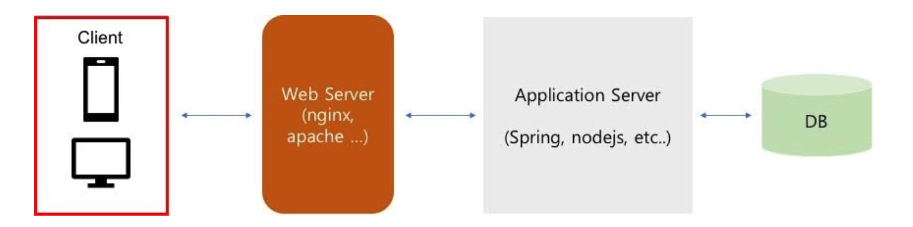
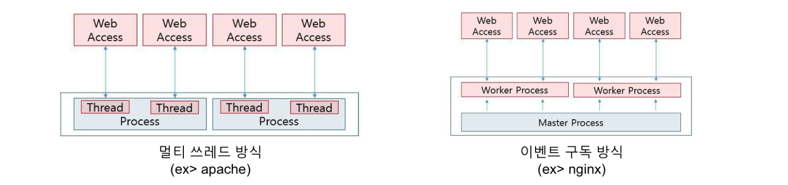

## Node

자바스크립트 프로그램을 실행할 수 있는 환경

## Node.js

> "node.js는 Chrome v8 javascript 엔진으로 빌드된 javascript 런타임이다."

- 기존에는 자바스크립트 프로그램을 웹 브라우저 위에서만 실행할 수 있었는데, 구글이 다른 엔진과 달리 매우 빠르고 오픈소스로 공개한 v8 엔진을 사용하여 크롬을 출시하면서 v8 엔진 기반의 노드 프로젝트가 시작되었음
- 노드는 v8(자바스크립트 엔진)과 liubuv(비동기 I/O)라는 라이브러리를 사용하고 C와 C++로 구현

> "**Node.js는 자바스크립트 프로그램이 서버로서 기능하기 위한 도구를 제공하고, 자바스크립트 프로그램이 동작하는 환경**" 을 의미한다.

## 서버에 Node 설치하기

1. 서버 접속
2. node 버전 관리 : nvm(Node version Manager) 설치

- [nvm](https://github.com/nvm-sh/nvm)은 node js 버전 매니저로 시스템에 여러 개의 nodejs 를 설치하고 사용할 버전을 쉽게 전환할 수록 도와주는 shell script로 [rvm(Ruby Version Manager)](https://rvm.io/)와 비슷한 역할을 수행함

1. cURL 설치

```c
 curl -o- <https://raw.githubusercontent.com/nvm-sh/nvm/v0.34.0/install.sh> | bash
```

2. Wget 설치

```c
wget -qO- <https://raw.githubusercontent.com/nvm-sh/nvm/v0.34.0/install.sh> | bash
```

3. 패키지 관리 : npm 설치

```c
# rpm -Uvh <http://dl.fedoraproject.org/pub/epel/6/x86_64/epel-release-6-8.noarch.rpm>
# yum -y install npm
```

4. node.js 설치

```c
# nvm install nodejs or [node 버전 입력]
```

## Ngnix

**웹 서버 소프트웨어**로, 가벼움과 높은 성능을 목표로 한다.

### 웹 서버

- 이미지, 동영상, 자바스크립트, HTML 등 다양한 문서를 제공하는 서버 시스템

  

- 웹 서버의 역할

  1. 데이터 전송

  - HTML 텍스트 파일을 비롯 이미지나 음성 데이터 같은 정적 컨텐츠를 웹 클라이언트에 전송
    ⇒ CSR에 의해 생성된 빌드 파일(정적 파일)을 제공할 수 있음

  2. 어플리케이션 실행

  - 웹 서버 내 PHP와 같은 모듈을 내장해 웹 서버가 직접 Application Server를 실행할 수 있음. 이를 통해 이미지 압축 등 기능을 사용할 수 있음

  3. 프록시 처리

  - 클라이언트의 요청을 Application Server로 전달하는 역할
  - 캐시 처리, 로드 밸런싱, 리버스 프록시 서버, 암호화 등을 처리할 수 있으며 웹 서버가 사용되는 가장 큰 이유 중 하나
  - 리버스 프록시 : 컴퓨터 네트워크에서 클라이언트를 대신해 한 대 이상의 서버로부터 자원을 추출하는 프록시 서버의 일종. 웹 서버 자체에서 기원한 것처럼 해당 클라이언트로 반환.

### Ngnix 특징



- 비동기 event driven에 의한 non blocking 처리
- 동시 접속수가 늘어날 수록 물리 메모리가 증가하는 프로세스 기반 apache 서버에 비해 소비 메모리량이 적어지면서 동시 처리수를 급격하게 늘릴 수 있음
- single thread 기반으로 마스터 / worker 프로세스 구동 방식을 채택하여 context switcing을 하지 않기 때문에 CPU 사용률을 감소시킬 수 있음
- 여러 기능을 모듈 단위로 개발하여 nginx를 컴파일할 때 필요한 모듈들만 조합해서 사용할 수 있음

### 설치

- yum 유틸리티 설치

```c
$ sudo yum install yum-utils
$ sudo yum install nginx
```

- ngnix 저장소 추가

```c
vi /etc/yum.repos.d/nginx.repo
```

- nginx.repo 파일 설정
  - name : 유저 이름baseurl : 데이터를 호출하기 위한 외부 저장소 urlgpgcheck : 프로그램 서명 여부 체크 (활성화 1, 비활성화 0)enabled : yum repo 추가 여부 (1, 0)

```c
[nginx]
name=nginx repo
baseurl=http://nginx.org/packages/centos/7/$basearch/
gpgcheck=0
enabled=1
```

- ngnix 설치

```c
yum install -y nginx
```

### config 설정

```c
vi /etc/nginx/conf.d/default.conf
```

```c
server {
    listen       53001;
    #listen       [::]:8080;

    #server_name  localhost; # 도메인 주소 넣는부분

    root /usr/dist/; # 배포할 프로젝트 dist 경로
    index index.html index.htm;

    client_max_body_size 100M;

    location / {
        root /usr/dist;
        index index.html;
        try_files $uri $uri/ /index.html; #경로 탐색
    }

    location /graphql {
        proxy_pass http://주소:54001/graphql;
    }

    error_page 404 /404.html;
        location = /40x.html {
    }

    error_page 500 502 503 504 /50x.html;
        location = /50x.html {
    }
}
```

- ngnix.conf 설정
  - 메인 configuration으로 여기에서 default.conf 호출

```c
vi /etc/nginx/nginx.conf
```

```c
worker_processes  1; ## master process 내부 worker process 수
events { ## 네트워크 동작방법 설정
    worker_connections  1024; ## 하나의 work process는 설정한 수만큼 연결 가능
}
http {
    include       mime.types;
    server {
        listen       80;
        location / {
            root   html;
            index  index.html index.htm;
        }
    }
}
```

- 설정 예시

```c
user  nginx;         ## NGINX 프로세스가 실행되는 권한, root 권한은 보안상 위험함
worker_processes  2; ## Default: 1, CPU 코어 하나에 최소한 한 개의 프로세스가 배정되도록 변경 권장
worker_priority   0; ## 값이 작을 수록 높은 우선순위를 갖는다. 커널 프로세스의 기본 우선순위인 -5 이하로는 설정하지 않도록 한다.

# 로그레벨 [ debug | info | notice | warn | error | crit ]
error_log  /var/log/nginx/error.log error; ## 로그레벨을 warn -> error로 변경함
pid        /var/run/nginx.pid;

events {
    worker_connections  1024; ## Default: 1024, 현 서버는 RAM 8GB라 상향조정
    multi_accept         off; ## Default: off
}

http {
    include       /etc/nginx/mime.types;
    default_type  application/octet-stream;

    log_format  main  '$remote_addr - $remote_user [$time_local] "$request" '
                      '$status $body_bytes_sent "$http_referer" '
                      '"$http_user_agent" "$http_x_forwarded_for"';

    access_log  /var/log/nginx/access.log  main;

    sendfile        on;
    #tcp_nopush     on;

        server_tokens     off; ## 헤더에 NGINX 버전을 숨김 (보안상 설정 권장)
    keepalive_timeout  65; ## 접속 시 커넥션 유지 시간

    #gzip  on;

    include /etc/nginx/conf.d/*.conf; ## conf 붙은 모든파일을 불러오는부분
}
```

- ngnix 실행

```c
systemctl reload nginx
systemctl start nginx
```

#### 리버스 프록시

- reverse proxing은 `proxy_pass`문법을 통해 이용이 가능합니다. "`/some/path/`로 들어온 url은 모두 `http://www.example.com/link/`로 처리하라" 라는 의미로, 클라이언트의 **요청을 특정 Url로 변환시키는 역할**을 수행
- /etc/nginx/site-available/default의 server 항목 수정
- 총 2개의 서버 항목이 존재할 수 있도록
- 기본 443 포트 사용, 추가 80번 포트 접속은 https로 리다이렉트

```c
server {
        listen                  443;
        server_name             {도메인 주소 1} {도메인 주소 2};
        ssl                     on;
        ssl_certificate         {공개키 경로};
        ssl_certificate_key     {개인키 경로};
        ssl_protocols           TLSv1 TLSv1.1 TLSv1.2;

        root {웹 루트 경로};

        index index.html index.htm index.nginx-debian.html;

        location / {
                try_files $uri $uri/ =404;
        }

}

server {
    listen 80;
    server_name {도메인 주소 1} {도메인 주소 2};
    return 301 https://{도메인 주소};
}
```

## Nginx 환경파일 공식문서

**[Full Example Configuration](https://www.nginx.com/resources/wiki/start/topics/examples/full/#)**

- [nginx.conf](https://www.nginx.com/resources/wiki/start/topics/examples/full/#nginx-conf) : 어플리케이션 기본 환경 설정
- [proxy.conf](https://www.nginx.com/resources/wiki/start/topics/examples/full/#proxy-conf) : 프록시 관련 환경 설정
- [fastcgi.conf](https://www.nginx.com/resources/wiki/start/topics/examples/full/#fastcgi-conf) : FastCGI 관련 환경 설정
- [mime.types](https://www.nginx.com/resources/wiki/start/topics/examples/full/#mime-types) : 파일 확장명과 MIME 타입 목록
- [nginx.conf](https://www.nginx.com/resources/wiki/start/topics/examples/fullexample2/#nginx-conf)
- [Another Full Example](https://www.nginx.com/resources/wiki/start/topics/examples/fullexample2/#)
- sites.conf : Ngnix에 의해 서비스되는 가상 호스트 웹사이트 환경 설정. 도메인마다 파일을 분리해서 만들 것을 권장
- 상태 확인

```c
sudo systemctl status nginx
```

- 서버 재시작 및 리로드

```c
// Restart ## 서버 중단 후 재가동
sudo service nginx restart

// Reload ## 서버 중단 없이 reload 시점 설정 파일만 다시 불러와 적용
nginx -s reload

reload // 설정 파일을 다시 불러오기
quit // 서버 shutdown
stop // 서버 즉시 중단
reopen // 로그 파일을 다시 열기
```

- 구성 테스트

```c
sudo nginx -t

# nginx: the configuration file /etc/nginx/nginx.conf syntax is ok
# nginx: configuration file /etc/nginx/nginx.conf test is successful
```

- Ngnix index.html 위치

```c
// NGINX
cd /usr/share/nginx/html
```
