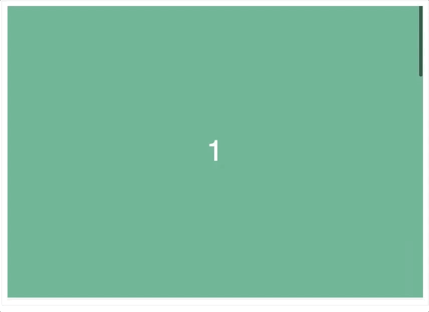

> fullpage 형식 페이지 구성시, 스크롤 되는 위치에 화면이 자연스럽게 위치되도록 도와주는 CSS 속성이다.
> 별도 API를 사용하거나 자바스크립트로 요소 위치를 계산할 필요 없이 간편하게 사용할 수 있다.



## 사용법

스크롤 스냅을 적용할 **부모 컨테이너 영역에 scroll-snap-type**을, **자식 영역에 scroll-snap-align** 속성을 적용한다.

```js
* 부모 스크롤 스냅 컨테이너 */
.scroll-container {
  overflow: auto;
  scroll-snap-type: y mandatory; /* y 축 방향으로만 scroll snap 적용 */
}

/* 자식 스크롤 스냅 영역 */
.scroll-area {
  scroll-snap-align: start; /* 스크롤 위치 맞춤 */
}
```

### 속성

#### scroll-snap-type : 스크롤 스냅이 동작하는 방식. 인자에 1) 스냅이 적용될 축 2) 스냅 적용 방식 지정

```js
.container {
	scroll-snap-type : [scroll snap axis], [scroll snap strictness];
}

/* y 방향으로 스크롤 스냅을 적용 */
.container {
  scroll-snap-type: y mandatory;
}

/* x 방향으로 스크롤 스냅을 적용 */
.container {
  scroll-snap-type: x proximity;
}
```

- scroll snap axis
  - x, y - 수평, 수직축
  - block, inline, both - block, inline, 개별축
- scroll snap strictness
  - none - 스냅하지 않음
  - proximity - 스크롤 위치가 스냅 위치에 가까워질때 스냅
  - mandatory - 스크롤 위치가 스냅 위치와 정확히 일치할때 스냅 ( madnatory 선언시 콘텐츠 간 간격이 넓을 때 콘텐츠를 스킵할 수 있다)

#### scroll-snap-align : 스크롤 스냅이 적용되는 요소가 스냅 위치에 정렬되는 방식. scroll-snap-type 축 기준 area 정렬

- none, start, end, center

#### scroll-padding, scroll-margin : 스크롤 영역의 패딩/마진 조정으로 스크롤 스냅이 적용되는 영역을 확보할 수 있음.

- 실제값이 변경되는 것이 아니라 뷰 포트에서만 적용
- 이 속성을 사용하면 이전, 다음 콘텐츠에 대한 예상 시나리오를 사용자에게 제공할 수 있음.

#### scroll-snap-stop : 스크롤 스냅 위치에 도달했을 때 스크롤 중지 여부 지정

- normal: 스크롤 스냅되더라도 계속 진행
- always: 스크롤 스냅 위치에 도달하면 중지
- 참고: https://developer.mozilla.org/en-US/docs/Web/CSS/CSS_Scroll_Snap
