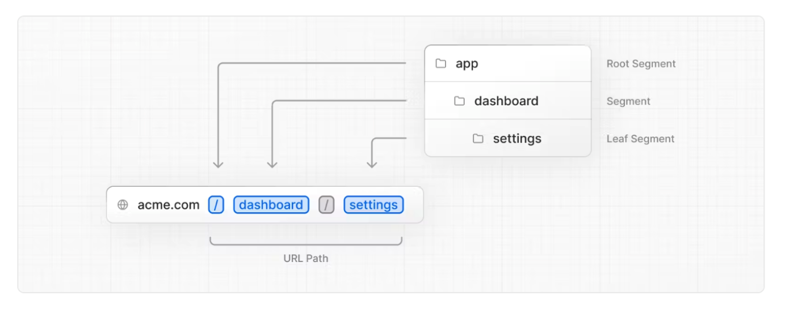
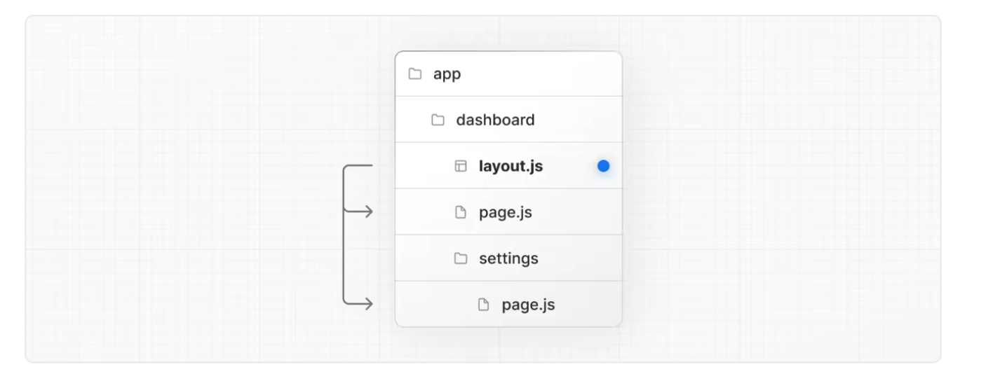

> 2022년 10월 26일 Next.js Conf에서 13버전을 발표했다. 2023년 5월 13.4 버전이 릴리즈 되었고, Turbopack(Beta)를 제외, App Router는 안정화(Stable)되었다고 한다.
>
> 현재, 기존 12 버전과 호환 가능하지만, 12.X 버전은 더이상 업데이트를 지원하지 않고, 13 버전을 사용할 것을 권장하고 있다. (하지만 개발 커뮤니티에서는 프로젝트를 돌릴 만큼 안정적이지 않다고..)

## 주요 변경사항

- 최소 요구 리액트 버전 17.0.2 → 18.2.0
- 최소 요구 Node.js 버전 12.22.0 → 14.6.0

### app 디렉토리, 새로운 App Router 제공

- 기존의 Next.js에서는 Automatic Routing을 사용할 때, pages 디렉토리 안에 파일을 생성하여 별도의 라우터 없이도 애플리케이션 내부에서 즉시 경로를 생성할 수 있었지만, 13버전부터는 `app/`이라는 새로운 디렉토리로 라우팅 및 레이아웃 기능을 개선함.
  
- **Layout**
  - 여러 페이지 간에 네비게이션 바와 같은 공통적인 UI를 공유하여 불필요한 리렌더링을 방지하고, 컴포넌트간의 상호 작용을 구현할 수 있음
- Next.js 13의 Routing은 app 디렉토리 안에서 진행되는데 이때, page.js 라는 단일 파일을 생성해야만 사용할 수 있음
  
- **React Server Component**
  - app 디렉토리에서 리액트 서버 컴포넌트를 사용하여 서버에서만 컴포넌트를 렌더링하고 클라이언트에 전송되는 자바스크립트의 양을 줄여 초기 페이지 로딩을 더 빠르게 수행할 수 있음
- **Streaming**
  - app 디렉토리에서 loading.js라는 예약 파일을 생성하여 사용자가 렌더링이 되기 이전에 로딩 중인 화면을 표시할 수 있는 기능
- **Data Fetching**
  - 이전 버전에서는 데이터를 fetching 해 올때, getServerSideProps나 getStaticProps를 통해 데이터를 가져왔지만, 13부터는 이 문법들을 사용하지 않음

```js
import {use} from 'react';

export default function getData() {
  const res = await fetch("https://cocone-m/com/todo");
  const data = await res.json();

  return data;
}

export default function Page() {
  const data = use(getData());
  return <div>{data.data}</div>
}
```

위와 같이 함수를 선언한 뒤에, use() 안에 넣어줌. 추가적으로, fetch 구문의 URL 뒤에 { cache: '' } 를 넣어줄 수 있는데, 속성에 따라 기존의 getServerSideProps, getStaticProps와 유사한 기능을 할 수 있음

- **Turbopack (beta)**
  - 기존의 웹팩보다 700배, Vite보다 10배 빠르게 JavaScript를 필요한 파일로 컴파일해주는 번들링 툴
- **`next/image`**
  - Image 컴포넌트를 통해서 이미지 파일을 넣으면 이미지가 자동으로 최적화됨. *이미지 최적화 : 이미지 로드가 느릴 경우에 기존의 레이아웃이 밀려나는 현상인 Layout Shift가 발생하는데, 이를 방지하기 위해 이미지의 width와 height를 설정함. 최신 버전에서는 이를 자동으로 처리함 `alt` 속성을 필수로 설정해야해서 웹 접근성 향상됨
- **`next/font`**
  - 자동으로 Layout Shift가 방지되고, **구글 폰트가 내장**되어 브라우저에서 구글 폰트 요청을 별도로 하지 않아도 사용할 수 있음
- **`next/link`**
  - `<Link>` 태그를 사용하려면 `<a>` 태그를 필요로 했던 이전 버전과는 달리, `<a>` 태그를 더이상 자식 요소로 필요하지 않음. 그렇기 때문에 기본 태그에도 props를 전달할 수 있게 됨
- **`OG Image`**
  - 링크를 첨부시 링크와 연관된 이미지가 같이 뜨는 것으로 콘텐츠 클릭의 참여를 높여줌. 신버전에서 동적 소셜카드를 새로 생성하는 라이브러리인 `@vercel/og`를 도입함
- [기타 변경사항](https://nextjs.org/blog/next-13-3)
